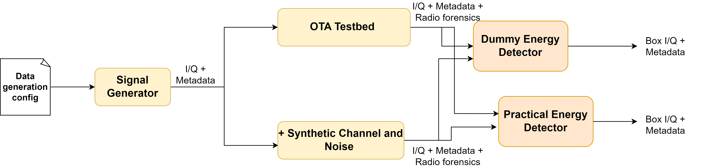
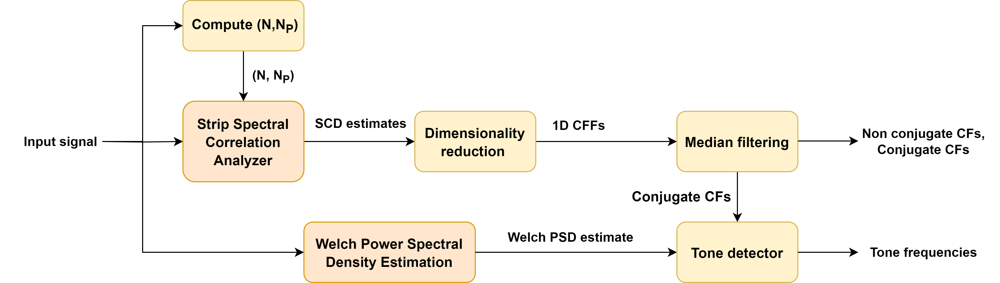

# CycloModRec - Blind Modulation Classification for RF Spectrum Sensing 

This repository contains the codebase for blind modulation recognition using second-order cyclostationary features. 

## Pre-processing 

## Feature Extraction

## Classifier Algorithm 

The modulation set considered comprises of commonly used digital modulation schemes such as {QAM, PSK, FSK, GFSK, MSK, GMSK, OOK, DSSS QAM, DSSS PSK}. Following are the capabilities of the algorithm:
* Classify the modulation type of the signal without any prior knowledge
* Along with the classification label, extract useful signal parameters such as symbol rate, carrier frequency etc. 
* When presented with an input exhibiting features that do not align with any pre-defined modulation types, flag it as an "unknown" type. This can also include noise.

## Folder structure 

.gitignore
.gitmodules
README.md
analysis.py
decisionTree.m
docs
filters
   |-- detectTone.m
   |-- filterBle.m
   |-- filterBpskBfsk.m
   |-- filterConjugateQamPsk.m
   |-- filterDqam.m
   |-- filterDsssLike.m
   |-- filterFsk.m
   |-- filterFsk8.m
   |-- filterGsm.m
   |-- filterMskGmsk.m
   |-- filterSymmetricAlphas.m
   |-- filterToneCfs.m
   |-- filterZigbee.m
main_classifier.m
modules
   |-- cyclostationary
   |-- utilities
   |-- yaml
startup.m
utilities
   |-- checkInstFreqSsca.m
   |-- computeAlphaDistance.m
   |-- constructAnalyticsVec.m
   |-- estimateSymRate.m
   |-- groundTruthModulation.m
   |-- peakFinder.m
   |-- readSearchlightMetadata.m
   |-- returnSscaParams.m
   |-- ssca1Dplot.m
   |-- sscaplot.m

## Running the codebase 

