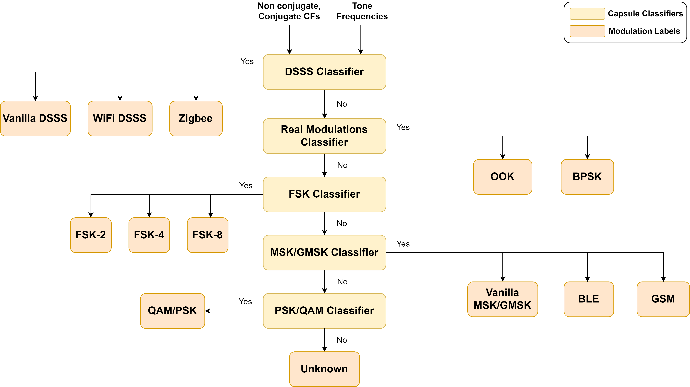

# CycloModRec - Blind Modulation Classification for RF Spectrum Sensing 

This repository contains the codebase for blind modulation recognition using second-order cyclostationary features. 

## Pre-processing 
The necessary pre-processing steps for the classifier are the application of an energy detector after the datasets are created (both synthetic and over-the-air). The performance can be evaluated with both a practical energy detector, as well as a dummy energy detector (to serve as a baseline). Each time-frequency boxed signal should have a 32-bit complex binary I/Q file, as well as metadata associated with it. 

These pre-processing steps are laid out in a separate repository, which can be cloned and used for this purpose. 
https://github.com/ucsdwcsng/synapse_preprocessing/tree/main

## Feature Extraction
For feature extraction, the Strip Spectral Correlation Analyzer (SSCA) is used in order to blindly estimate the cycle frequencies. Apart from cyclostationary features, frequency domain features are also used from the Welch PSD estimate. These features are extracted by median-filtering based thresholding. 

## Classifier Algorithm 

The modulation set considered comprises of commonly used digital modulation schemes such as {QAM, PSK, FSK, GFSK, MSK, GMSK, OOK, DSSS QAM, DSSS PSK}. Following are the capabilities of the algorithm:
* Classify the modulation type of the signal without any prior knowledge
* Along with the classification label, extract useful signal parameters such as symbol rate, carrier frequency etc. 
* When presented with an input exhibiting features that do not align with any pre-defined modulation types, flag it as an "unknown" type. This can also include noise.

## Instructions for Running the Codebase

1. Clone the repository to your local machine using the following command:

git clone https://github.com/your-username/your-repository.git

2. Go to main_classifier.m and change the main_folder variable to the dataset folder you want to process. Following is the folder structure it should obey: 

- dataset
  - class 1
    - file1.32cf
    - file1.metadata
    - ......
  - class 2
    - file1.32cf
    - file1.metadata
    - ......
  .....

In this structure:

- The `dataset` folder is the root folder that contains the class folders.
- Each class folder (e.g., `class1`, `class2`, `class3`, etc.) represents a specific class or category.
- Inside each class folder, there should be the respective 32-bit complex I/Q files for that class, with their corresponding metadata.
- You can have as many class folders as needed, depending on the number of classes in your dataset.

3. Run main_classifier.m and the confusion matrix and analysis jsons will be created and stored. 
4. After the classifier runs, the prediction jsons will be stored in a folder. Use that folder and run the analysis.py script in order to obtain plots of different quantities with respect to accuracy. 
